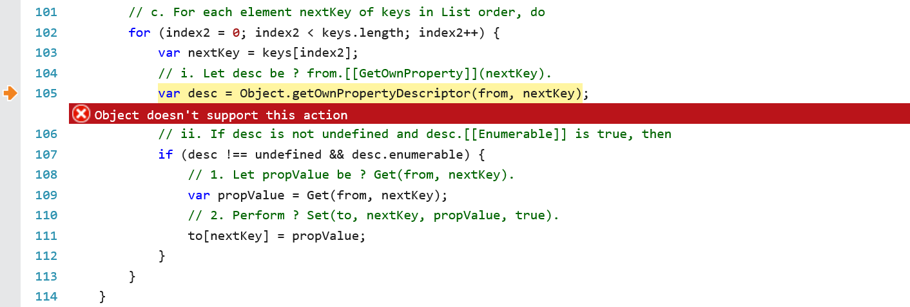
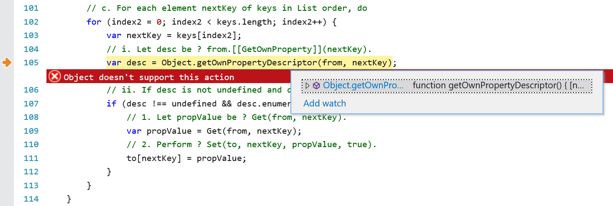

This project demonstrates an error that occurs in Internet Explorer 11 (IE 11) involving @reach/router and polyfill.io.

Polyfill.io script:

-   https://polyfill.io/v3/polyfill.js?features=Promise,Object.assign,Object.getOwnPropertyDescriptor

The error occurs on line 105 of this script:

`var desc = Object.getOwnPropertyDescriptor(from, nextKey);`

The error is:

> SCRIPT445: Object doesn't support this action

Data:

`from` = `[object DispHTMLLocation]`  
`nextKey`=`"hash"`

Discussion:

If I debug this in IE 11, and change the exception behavior to "break on unhandled exceptions", the debugger will break on line 105, as described above. What's perplexing, however, is that if I mouse over `Object.getOwnPropertyDescriptor`, a tooltip appears showing the definition of the function, so I don't know why IE 11 is saying the action is not supported. What action is the error referring to? Also, according to the [MDN browser compatibility table](https://developer.mozilla.org/en-US/docs/Web/JavaScript/Reference/Global_Objects/Object/getOwnPropertyDescriptor#Browser_compatibility), `Object.getOwnPropertyDescriptor` is supported starting with _IE 8_.

Images from the debugger:

